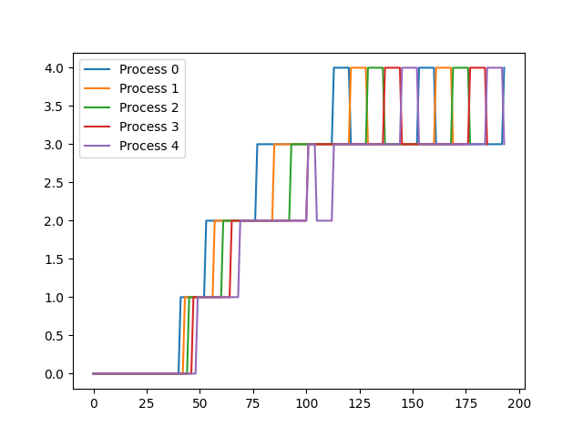

# Enhanced xv-6

**Advanced Process Management and Scheduling in xv6**

Here's a description of what we've accomplished with this project (LLM generated). Please find our technical report [here](https://github.com/FlightVin/Enhanced-xv6/blob/riscv/REPORT.md).

---

## Table of Contents

- [Introduction](#introduction)
- [Key Features](#key-features)
  - [System Call Tracing](#system-call-tracing)
  - [Enhanced Scheduling Algorithms](#enhanced-scheduling-algorithms)
  - [Copy-on-Write Mechanism](#copy-on-write-mechanism)
- [Implementation Highlights](#implementation-highlights)
- [Performance Analysis](#performance-analysis)
- [Limitations & Future Work](#limitations--future-work)
- [Getting Started](#getting-started)
- [Acknowledgments](#acknowledgments)

---

## Introduction

This project enhances the xv6 operating system by introducing advanced process management features, comprehensive system call tracing, and multiple sophisticated scheduling algorithms. The primary goal is to improve system efficiency, provide better insights into process behaviors, and optimize CPU utilization through various scheduling strategies. Additionally, implementing a copy-on-write mechanism enhances memory management, ensuring efficient use of resources.

---

## Key Features

### System Call Tracing

- **Selective Tracing:** Introduced the `trace` system call, enabling developers to monitor specific system calls for selected processes. This fine-grained control facilitates in-depth debugging and performance analysis.
  
- **Inherited Tracing Options:** Ensured that child processes inherit tracing settings from their parents, maintaining consistent monitoring across process hierarchies.

- **Comprehensive Logging:** Captured essential details such as process IDs, system call names, arguments, and return values, providing valuable insights into system interactions.

### Enhanced Scheduling Algorithms

Implemented and integrated multiple scheduling algorithms to optimize CPU usage and process management:

1. **First-Come, First-Served (FCFS):**
   - **Non-Preemptive Scheduling:** Processes are scheduled in the order they arrive, minimizing context switching overhead.
   - **Efficiency:** Demonstrated the lowest wait times due to its straightforward approach.

2. **Lottery-Based Scheduling (LBS):**
   - **Fairness Through Randomization:** Allocates CPU time based on lottery tickets, ensuring probabilistic fairness among processes.
   - **Flexibility:** Allows dynamic adjustment of process priorities by modifying ticket counts.

3. **Priority-Based Scheduling (PBS):**
   - **Dynamic Prioritization:** Assigns priorities to processes, balancing CPU allocation based on process importance and behavior.
   - **Adaptive Control:** Incorporates run time, sleep time, and niceness to adjust priorities dynamically.

4. **Multilevel Feedback Queue (MLFQ):**
   - **Hierarchical Queues:** Utilizes multiple queues with varying priorities, allowing processes to move between queues based on their behavior and execution history.
   - **Performance Optimization:** Balances responsiveness and throughput, adapting to diverse workloads effectively.

### Copy-on-Write Mechanism

- **Memory Efficiency:** Implemented a copy-on-write (COW) strategy to optimize memory usage during process creation. This approach delays the actual copying of memory pages until a write operation occurs, reducing unnecessary memory duplication.
  
- **Enhanced Performance:** Minimizes memory overhead and accelerates process forking by sharing memory pages between parent and child processes until modifications are necessary.

---

## Implementation Highlights

- **System Call Enhancements:**
  - Augmented the `struct proc` to include tracing options.
  - Modified the syscall handler to incorporate tracing logic based on process-specific settings.
  - Ensured thread-safe updates and reset tracing options upon process termination.

- **Scheduling Algorithms:**
  - **FCFS:** Leveraged process creation timestamps to determine execution order.
  - **LBS:** Introduced a ticket-based system allowing dynamic ticket allocation per process.
  - **PBS:** Developed mechanisms to adjust priorities based on runtime metrics and user-defined settings.
  - **MLFQ:** Designed a robust queue management system supporting multiple priority levels and aging to prevent starvation.

- **Copy-on-Write:**
  - Extended page table entries with COW flags to manage shared memory pages.
  - Enhanced memory allocation and deallocation routines to account for shared references.
  - Handled page faults gracefully to trigger COW behavior, ensuring system stability.

---

## Performance Analysis

The implemented scheduling algorithms were rigorously tested to evaluate their performance under various workloads. Key metrics include average response time (rtime) and wait time (wtime):

- **Round Robin (RR):** Avg rtime: 25, Avg wtime: 120
- **First-Come, First-Served (FCFS):** Avg rtime: 74, Avg wtime: 87
- **Lottery-Based Scheduling (LBS):** Avg rtime: 18, Avg wtime: 119
- **Priority-Based Scheduling (PBS):** Avg rtime: 25, Avg wtime: 109
- **Multilevel Feedback Queue (MLFQ):** Avg rtime: 18, Avg wtime: 167

### MLFQ Scheduling Analysis



*The MLFQ demonstrates robust performance, effectively managing process priorities and maintaining low response times despite single CPU constraints.*

---

## Limitations & Future Work

- **Trace Options Bit Limitation:** Currently, the `traceOpt` is a signed integer, limiting reliable tracing to the first 31 system calls. Future enhancements could extend this capability by utilizing larger data types.

- **MLFQ Exploitation:** Identified potential for processes to manipulate queue placement by voluntarily yielding CPU time. Implementing safeguards can mitigate this vulnerability.

- **Scalability:** While the current implementation supports essential scheduling algorithms, extending support for more complex or hybrid scheduling strategies could further enhance system performance.

---

## Getting Started

To replicate and experiment with the enhanced xv6 system, follow these steps:

1. **Clone the Repository:**
   ```bash
   git clone https://github.com/flightvin/advanced-xv6.git
   cd advanced-xv6
   ```

2. **Build the Project with Desired Scheduler:**
   - **FCFS:**
     ```bash
     make clean
     make qemu SCHEDULER=FCFS
     ```
   - **Lottery-Based Scheduling:**
     ```bash
     make clean
     make qemu SCHEDULER=LBS
     ```
   - **Priority-Based Scheduling:**
     ```bash
     make clean
     make qemu SCHEDULER=PBS
     ```
   - **Multilevel Feedback Queue:**
     ```bash
     make clean
     make qemu SCHEDULER=MLFQ CPUS=1
     ```

3. **Run and Test:**
   Execute the built xv6 system using QEMU and test the implemented features as per your requirements.

---

## Acknowledgments

Special thanks to the xv6 development community for providing a solid foundation for this project. Appreciation is also extended to educators and peers who contributed valuable insights and feedback throughout the development process.

# License

This project is licensed under the [MIT License](LICENSE).
