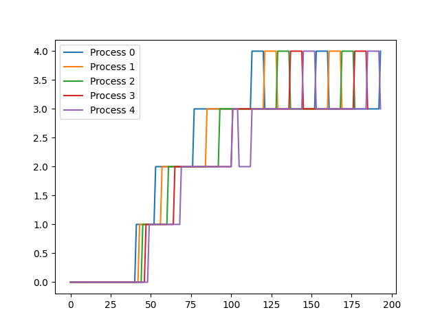

# REPORT
# 2021101058, 2021101103

## Specification 1
### System call 1 : `trace`  
`int trace(int traceNum)`

To trace system calls only for a set of processes, we need to know if we need to trace for the currently running process. Thus we add `traceOpt` to `struct proc`.  
This variable holds 0 by default to indicate that no systemcalls are to be traced. To trace the `i`th system call, the `i`th bit is turned on (`1 << i` is added).  
Every child of a process inherits its parent's `traceOpt`. This is achieved by copying the value of `traceOpt` to the new process when forking.  
When a process invokes a system call, it calls the `syscall` function. In this function we check if tracing is on for the process and if the system call (whose syscall number defined in `syscall.h` is stored in the variable `num`) is to be traced using bit operations. If tracing is on for this system call for this process, we get the pid of the process, the syscall name (from the `syscallName` array), the arguments(using `argint` function, the argument count is stored in the array `syscallArgC`) and the return value of the syscall(from `p->trapframe->a0`).  
When a process is freed in `freeproc`, `traceOpt` is reset to 0.  
**Limitation**: The variable `traceOpt` is a signed integer(usually 32 bits long) since xv6 only provides the use of `argraw` within `sysproc.c`. Thus only the first 31 syscalls can be reliably traced. To get around this issue, `traceOpt` can be declared as `uint64`. This requires the addition of the declaration of `argraw` to `defs.h` for `syscall.c` and the replacement of `argint` calls with `argraw` where necessary. This has not been done to maintain the abstraction provided by `argint`,  `argaddr` and `argfd` and since it is quite unlikely that there will be an addition of so many system calls that will need to be traced.  

### System calls 2 and 3 : `sigalarm and sigreturn`
`int sigalarm(int, void*);`

`int sigreturn(void);`

We make the additions of `sigalarm_en` (to check if the process is inside an alarm sequence at the moment), `sigalarm_ticks` (to count the number of times that the process should have gotten a timer interrupt before calling the handler function), `sig_handler` (to store the handler function), `current_ticks_count` (to count the number of times that the process has gotten a timer interrupt) and `tm_backup` (the backup of the trapframe of the process) to `struct proc` in proc.h file.

Trap.c has to be modified by making changes to the function `usertrap`. We add a section to check when the `devintr()` function returns 2 which corresponds to a timer interrupt. Here, we increment the `curret_ticks_count` by 1, and check if the conditions for a handler call have been satisfied. If so, we enable `sigalarm_en` and reinitialize `sigalarm_ticks_count` to 0. Further, create the copy of the `trapframe` in `tm_backup` and update the program counter, `epc`, to call the handler function.

In `proc.c` we update `allocproc` to initialize the newly added attributes in `struct proc`. All information is set to 0 on `freeproc`.

`sys_sigalarm` in `sysproc.c` just reads the information from registers passed by the `sigalarm` function and sets it into `sigalarm_ticks` and `sigalarm_handler`. `sys_sigreturn` copied the backup trapframe `tm_backup` back into the trapframe to counter the effect of changed registers by the handler function and sets `sigalarm_en` to 0 thereby saying that the sequence has ended. It returns the a0 register, i.e., the return value of the process that sigreturn was called on.

---

## Specification 2  
### FCFS(First Come First Serve)  
Enable with : `make clean; make qemu SCHEDULER=FCFS`  
First off, we need to modify the makefile to declare a macro according to the SCHEDULER option given when compiling. The makefile defines FCFS to 1 in every file it compiles, so now we knkow when to use FCFS.  
To select the first process to serve it, we need to know the time when the process was created. This is measured in ticks and is stored in `uint creation_time` variable in `struct proc` in `proc.h`. Next, in `proc.c`, when a process is allocated, we define its creation time to be the current ticks.  
In the function `scheduler`, we check if the FCFS macro is defined. We keep track of the earliest created process by iterating through the process table, acquiring and releasing locks as necessary(release lock if it is not going to be run(keep the lock of the earliest process)). On finding the earliest created process, we run it.  
Preemption is disabled by checking if FCFS is defined before calling `yield` to give up CPU time in `trap.c`.  

### Lottery Based Scheduling
Enable with : `make clean; make qemu SCHEDULER=LBS`  
Add `int tickets` variable to `struct proc` in `proc.h` to keep track of the number of tickets a process has.  
Implemented the `settickets` system call that changes the number of tickets of the current process.  
Initialise tickets of the process to 1 in `allocproc` in `proc.c`.  
In `schedule` in `proc.c` if `LBS` is defined, find the total number of tickets currently held by processes that are `RUNNABLE`. Randomly pick a winning ticket and find the process with the winning ticket by again iterating over all processes and run it. 

### Priority Based Scheduling
Enable with : `make clean; make qemu SCHEDULER=PBS`  
Added variables `run_time`, `sleep_time`, `num_scheduled`, `static_priority` and `niceness` to `struct proc` in `proc.c`.  
Initialise default values of 0, 0, 60, 5 respectively in `allocproc`.  
Implemented `set_priority` system call to change the static priority of a process with given pid. Also made user program `setpriority` that calls the system call with command line arguments.  
`run_time` and `sleep_time` variables are updated whenever a clock interrupt occurs.  
`niceness` is updated whenever dynamic priority is calculated or when static priority of a process is changed with `set_priority`.  
`set_priority` resets `run_time` and `sleep_time` to 0 and `niceness` to 5. If the new static priority of a process is higher than before (numerically lower), then the process yields for rescheduling.  
In `scheduler` function in `proc.c`, created variables to track the process with highest priority(numerically lowest dynamic priority value) and its dynamic priority. Made an array `cases` with the case and tiebreakers when the highest priority process must be changed to the current process. Check if any of the entries in `cases` is true to update highest priority process. On finding the highest priority process, run it and increment `num_scheduled`.    
Since it is non preemptive, turn off yielding in `trap.c`.  

### Multilevel Feedback Queue
Enable with : `make clean; make qemu SCHEDULER=MLFQ CPUS=1`  
Add `wait_time`, `is_in_queue`, `queue_num` and `curr_run_time` to `struct proc` in `proc.h`. Initialise these to 0 in `allocproc.c`. Update the waiting time in the `update_time` function.    
Made `struct _mlfq_queue` to store information about the five queues. Made `mlfq.h` and `mlfq.c` to implement it. Offers functions to initialise(called in main), dequeue, enqueue and remove from middle.  
In the `scheduler` function in `proc.c` we first put the processes in their correct queues. To do this, we iterate over all processes and check if the process has to be shifted to a higher queue(due to aging) or if a process is not in any queue, put it at the end of queue 0. After finishing this, try to dequeue a process from the queues in order from 0 to 4 and as soon as a process is found, run it.    
When a usertrap/kerneltrap occurs and we regain execution, we check if there are any processes in a higher priority queue to execute. Also, we check if a process has exceeded its time slice and if so remove it from execution and put it in the lower priority queue.   
**Exploitation of MLFQ by a process**: Since if a process exceeds its time slice it gets pushed to a lower queue but if voluntarily relinquishes control, it goes to the back of the same queue, a process can yield the CPU before its time slice expires to stay in the same queue, bypassing the deprioritasition. 

## Analysis  
RR : Avg rtime 25, avg wtime 120  
FCFS :  Avg rtime 74, avg time 87  
LBS : Average rtime 18,  wtime 119  
PBS : Average rtime 25,  wtime 109  
MLFQ : Average rtime 18,  wtime 167  

---

## Specification 3
### Copy-on-write

We will need a new flag to check whether a pte references a physical page with copy-on-write implemented. Every pte's first 10 bits are reserved for flags with the 9th and 10th bit available for handling things according to programmer's discretion. We assign one of these two bits as `PTE_COW`.

When a child process is created, it's memory is allocated using `uvmcopy` in `vm.c`. We will need to modify this function to map the child's (new) pagetable to the same physical address as that of the parent (old) process. So, we can update the function in the `for` loop to extract the flags of the pte received by `walk`ing the pagetable old by removing the write flag, `PTE_W`, and adding that we are handling copy-on-write using the `PTE_COW` flag. 

After mapping the pte inside the `new` pagetable to the same physical address `pa` we need to handle the number of virtual addresses pointing to a physical page. To do this, we will need to maintain an array the size of the maximum number of physical pages. This array has been initiated in `kalloc.c`'s `kinit` with a spinlock `pte_updation_lock` to only allow one process to update the array at a given moment. Functions `increase_pte_count` and `decrease_pte_count` increment and decrement an element in the array `pte_count`. In `kalloc.c`, we also change `kfree` function to only fill in a memory block with jargon only if the number of ptes addressing it is 0. `kalloc` increases the number of ptes referencing the physical page.

Now, a pagefault is generated whenever a write is executed in a copy-on-write enabled physical address since we disable the write flag. Here, we catch it in `trap.c` within the `usertrap` function using `r_scause() == 15` and then check whether the flags of the pte are valid. If not, we kill the process. If the flags are appropriate, we remove the `PTE_COW` flag and add the `PTE_W` flag before allocation memory for a new physical page, copying required contents from the old physical address and then changing the pte to reference the newly allocated physical address. 

Finally, we also need to update the `copyout` function which copies from source to destination virtual address. We handle this the same way we handle page faults for copy-on-wrote in `trap.c`

---

## Specification 4

Details about the implementation of the scheduling algorithms have been included under Specification 2

Notable facts are - 
1. FCFS has the least wait time because of no pre-emption
2. MLFQ performs very well despite the constraint of using only one CPU

### MLFQ Scheduling Analysis

